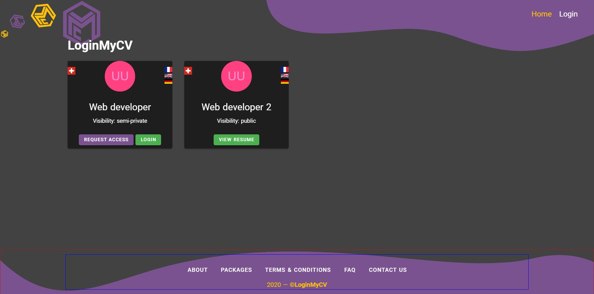
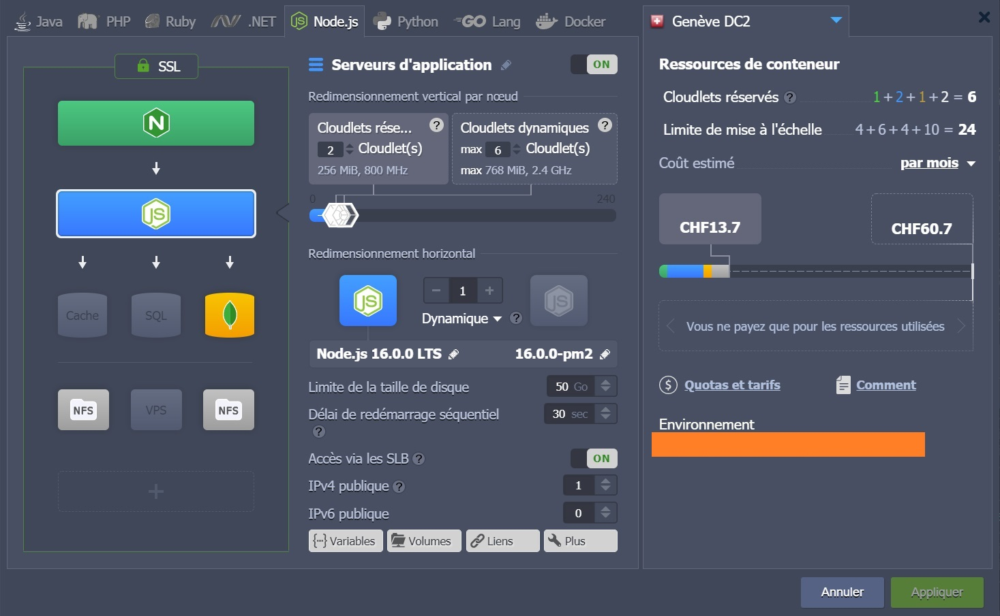
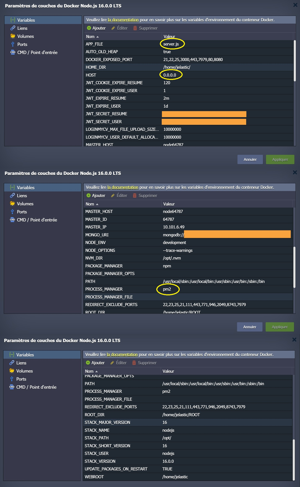
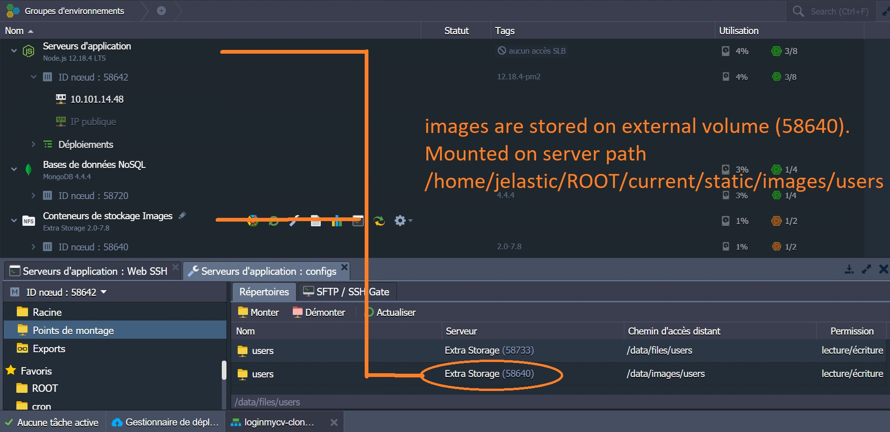
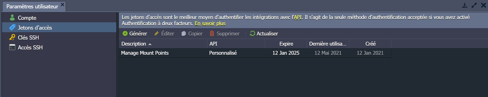
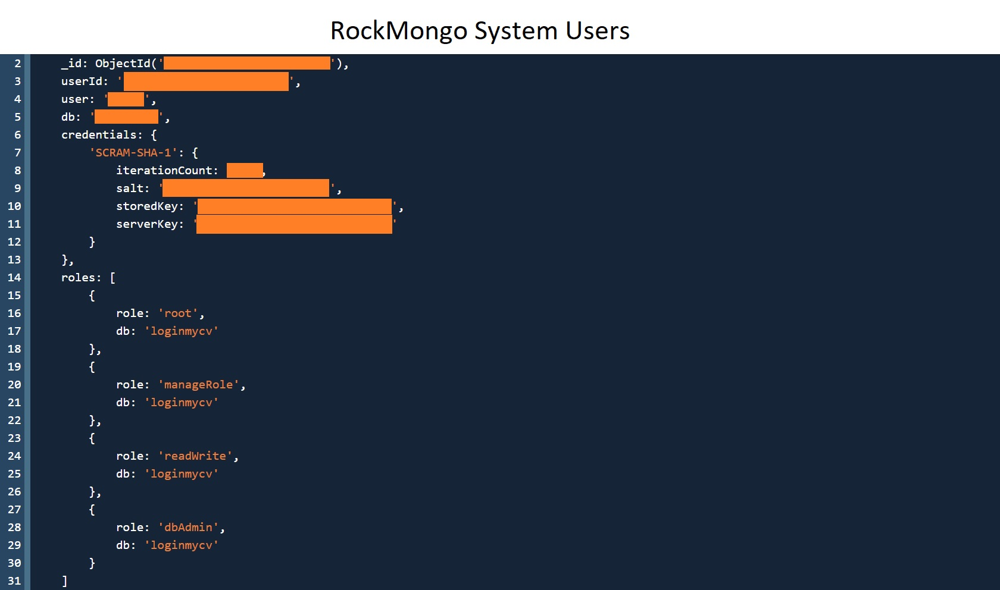
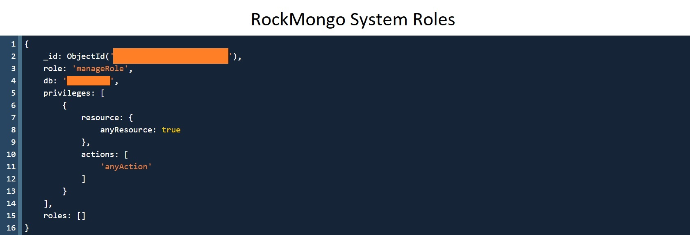
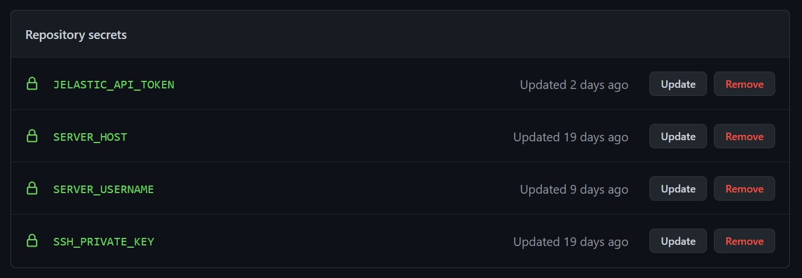

# loginmycv

> Provide secured access to your CV online



## Install Dependencies

```
npm install
```

## Run App

```
# Run in dev mode
npm run dev

# Run in prod mode
npm start
```

Visit http://localhost:3000

## Database Seeder

To seed the database with users, bootcamps, courses and reviews with data from the "\_data" folder, run

```
# Destroy all data
node api/seeder -d

# Import all data
node api/seeder -i
```

In case of error during seeding, try deleting MongoDB indexes.

## Jelastic Deployment








Set the main application executable file as environment variable
```
APP_FILE=server.js
PROCESS_MANAGER=pm2
HOST=0.0.0.0
```

## CI/CD GitHub Actions Secrets




## General observations for developers
### Protected pages

req.user parameter is available backend if and only if auth middleware is called on router object.

### Server logs
```
pm2 logs --lines 100
```
